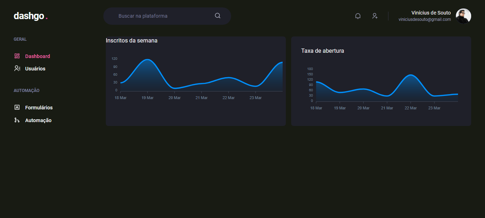
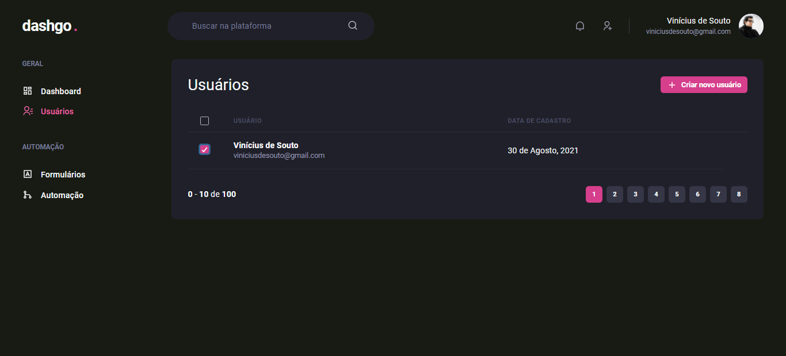
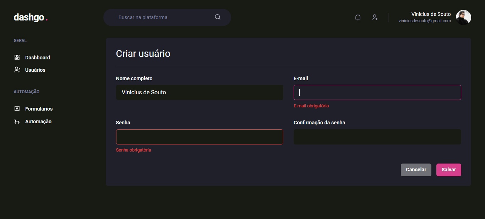
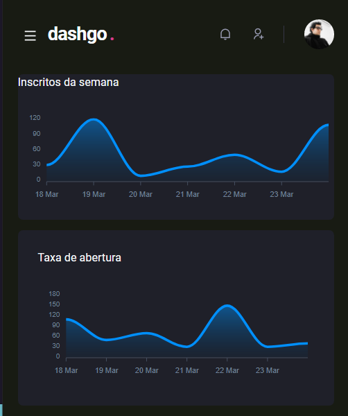

<h1 align="center">
  dashgo.
</h1>

This project is about a simple dashboard, with charts, responsivity, form, login, and more...

## 🚀 | Technologies

The technologies than I used for build it were:

- [React](https://reactjs.org)
- [Next.js](https://nextjs.org/)
- [ChakraUI](https://chakra-ui.com/)
- [Framer Motion](https://www.framer.com/motion/)
- [Apexcharts](https://apexcharts.com/)

I also used yup, for validating the data on form, and form is builded with junction of yup and react-hook-form.
And I also took care to maintain responsiveness!!!

## 🔖 | Layout

Look this layout, I really like the use of this chart type!

<p align="center">
  
  
  
  
</p>

## :gear: | If you want testing

```bash
  ### install the dependencies
  $ yarn
  
  ### running aplication
  $ yarn dev
  
  ### you can see on port http://localhost:3000
```

I see you later, bye 👋🏻

Developed with ❤️ by [Vinicius de Souto](https://github.com/soutovnc)
